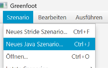
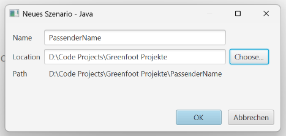
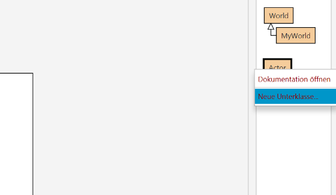
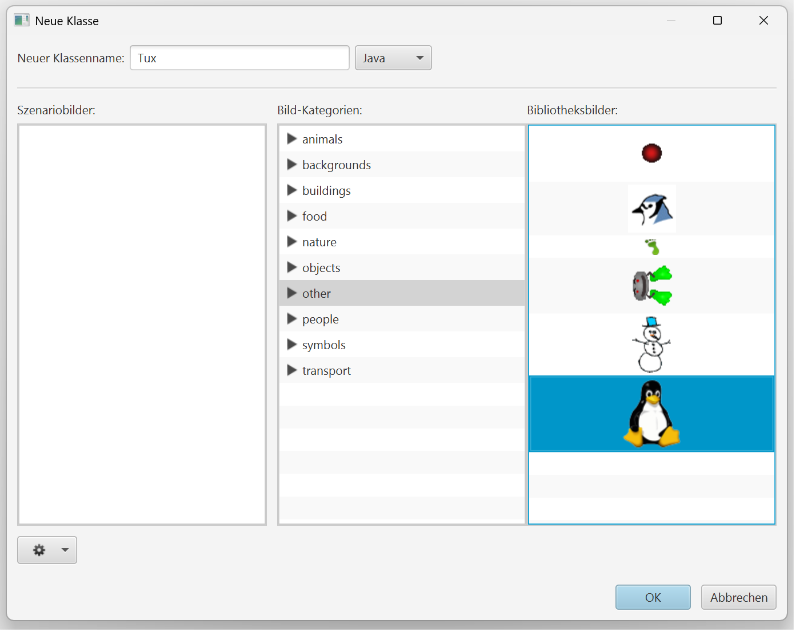
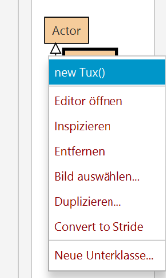
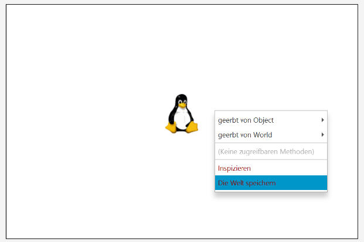
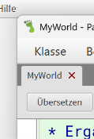

# Gui

## Neues Szenario
Ganz oben links:

Speicherort wählen:

Rechtsklick auf Actor:

Name und Bild wählen:

Neues Objekt zur Welt hinzufügen:

Platzieren und danach die Welt speichern (damit man nach Reset nicht neu platzieren muss)

MyWorld Tab wieder schließen (schauen wir uns später an)

