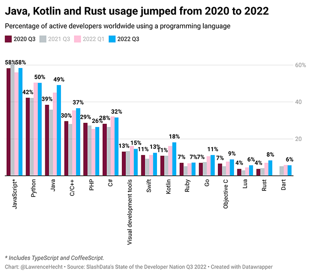

# Motivation

## Eure Motivation:
### Was ist jetzt gerade eure Motivation?
### Was ist eure Motivation, um weiterzumachen?

## Warum Programmieren lernen?
- Programme stecken überall drin: Internet, Auto, 

## Warum Java?
- Java ist immer noch populär und wichtig
- Explizites Typing (int, String, boolean...) ist gut zum Verstehen

[Ganzer Report &#x2197;](https://research.slashdata.co/reports/65b90093343d024fbe6c7f53), [Aritkel &#x2197;](https://thenewstack.io/java-usage-keeps-climbing-according-to-new-survey/)

## Warum Greenfoot?
- Explizit gestaltet zum Lernen
- Gute Oberfläche
- Gute Möglichkeiten zum debuggen
- Gute Möglichkeiten viele Dinge manuell zu machen und zu untersuchen

## Demotivation
- Programmieren kann sehr frustrierend sein, aber je frustrierender der Bug desto größter der Erfolg, wenn er gelöst ist! Und ich unterstütze euch
- KI kann doch super programmieren... ihr lernt hier auch logisches denken und Probleme lösen im Allgemeinen und es ist schön zu verstehen, was die KI macht. 